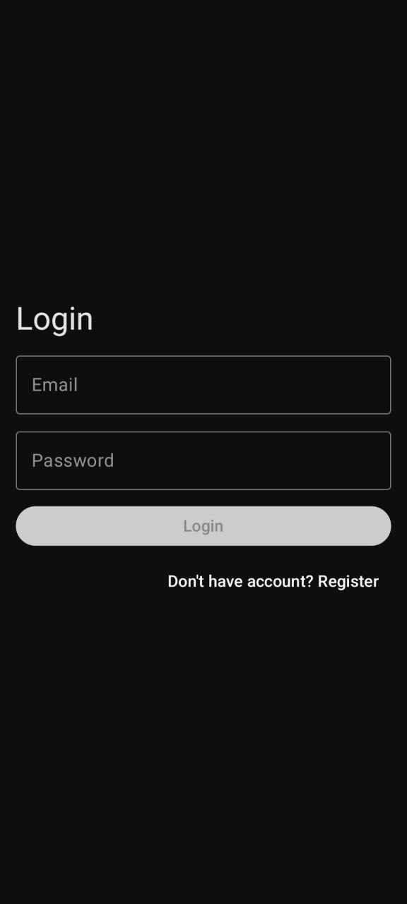
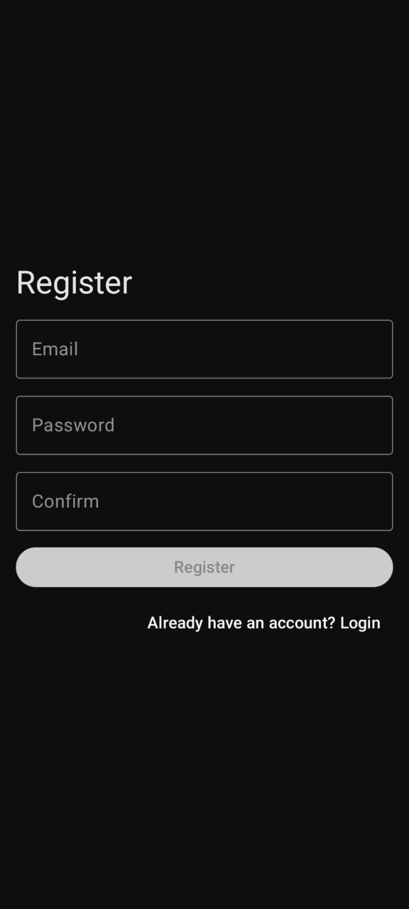
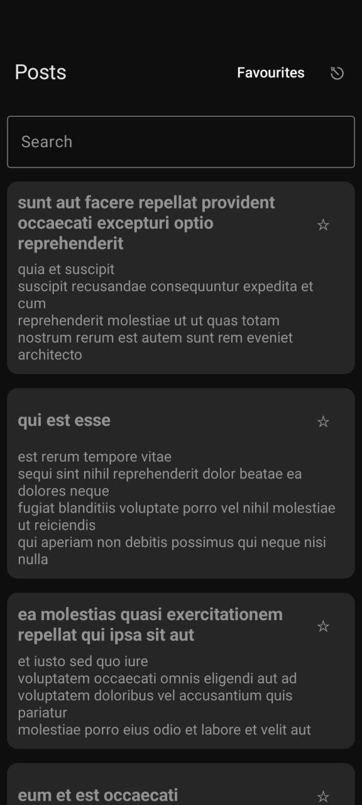
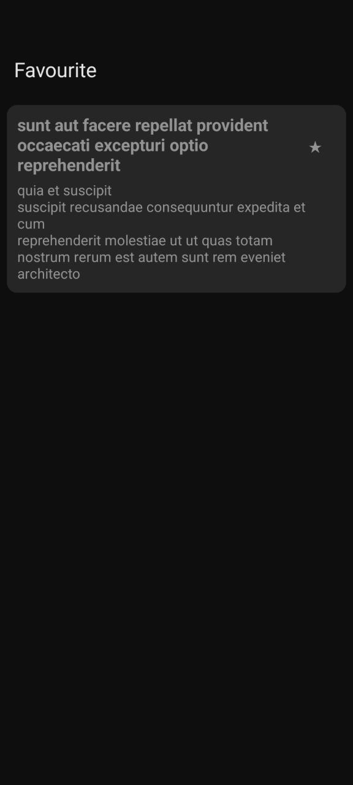
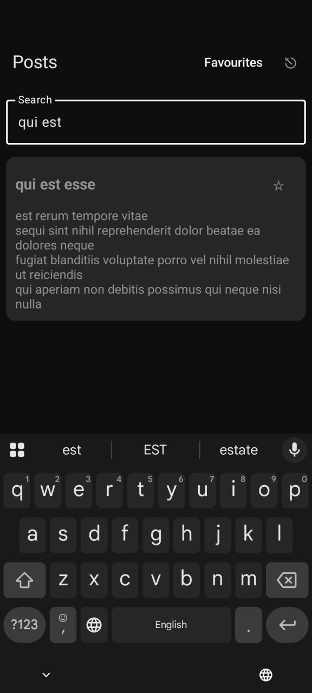
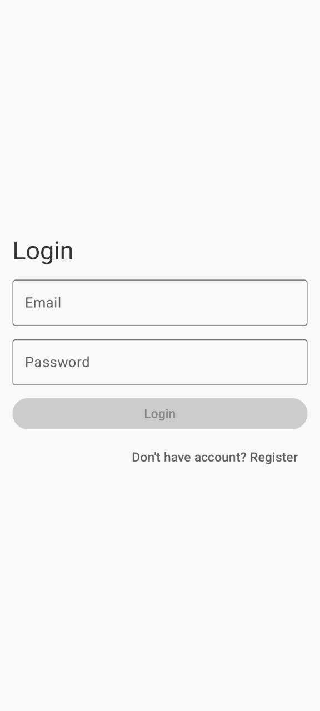
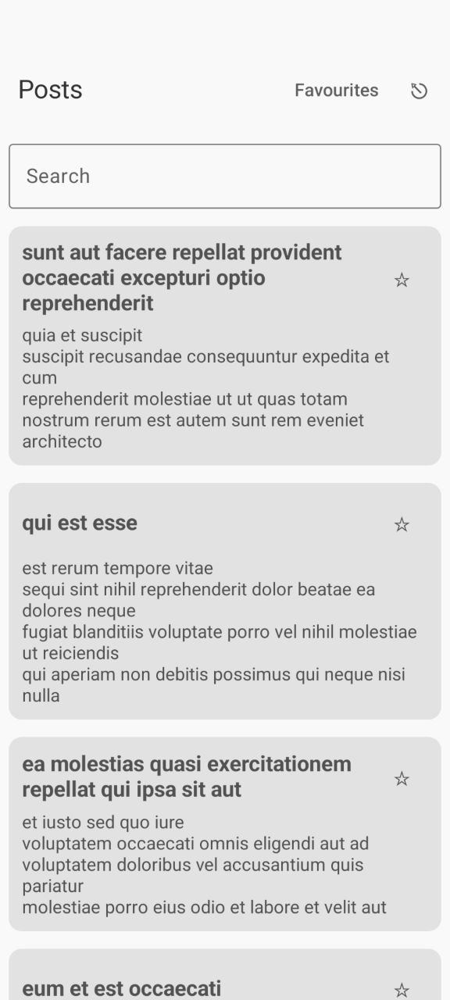
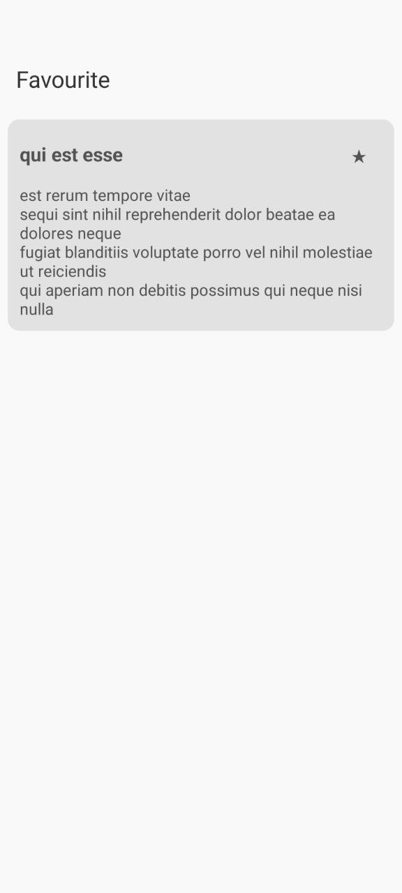

# 📱 PostApp

A simple Android app built with **Jetpack Compose, Clean Architecture, and Hilt DI**, showcasing posts from a remote API, local caching, authentication, and favourites management.

---

## 🚀 Setup & Build Instructions

1. **Clone the repository**
   ```bash
   git clone https://github.com/towhidSoyon/PostApp.git
   cd PostApp
2. Open in Android Studio

  - Use the latest Android Studio (Ladybug or later).

  - Ensure you have JDK 17 installed.

3. Build & Run

  - Sync Gradle files.

  - Select a device/emulator with Android 8.0 (API 26) or higher.

  - Run the app.

**🏛️ Architecture & Libraries Used**

Architecture
 - Clean Architecture + MVVM
    - Presentation Layer: Jetpack Compose UI + ViewModels.
    - Domain Layer: Use Cases, business logic.
    - Data Layer: Repository pattern with Room DB + Retrofit API.
 - Unidirectional Data Flow with Kotlin Flows.

Libraries
- Jetpack Compose – UI toolkit.
- Hilt – Dependency Injection.
- Room – Local database persistence.
- Retrofit + OkHttp + Moshi – Networking & JSON parsing.
- Napier – Multiplatform logging.
- Coroutines + Flow – Asynchronous & reactive programming.
- Material 3 – Modern UI design system.

✅ Features
- User registration and login (with SHA-256 password hashing).
- Fetch posts from remote API and cache them locally.
- Search posts by query.
- Mark/unmark posts as favourites.
- View favourites in a separate screen.
- Logout functionality with shared preferences.
- Dark/Light theme support with Material 3 dynamic colors.

📌 Assumptions / Limitations
- Authentication is stored locally with hashed passwords (no real backend auth).
- Posts are fetched from JSONPlaceholder API.
- Offline mode works with cached posts, but only for previously fetched pages.
- Error handling is basic (simple error messages via state).
- App icon is a placeholder.


## Screenshots

<p align="center">
  
  
  
  
   
   
   
   
   
</p>
